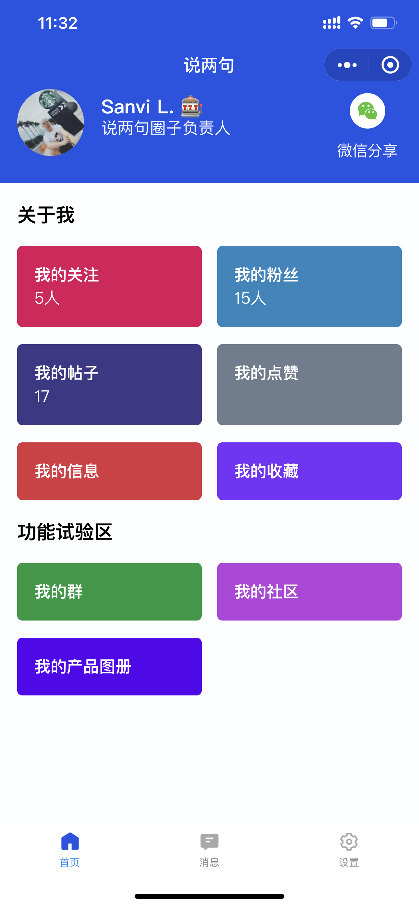
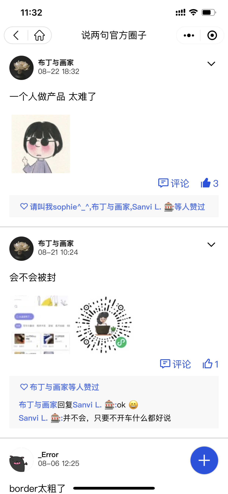

# shuoliangju-client-open

说两句是一个类似知识星球的微信小程序的开源实现

shuoliangju 是一个基于Taro2.0框架实现的微信论坛小程序，你可以通过该程序来创建自己的论坛小程序，也可以邀请别人到你的社群进行参与讨论。

## 特性

1. 每个用户可以创建自己的群组
2. 管理员权限
3. 帖子可以无限层级回复，并且有文章、动态两种发帖形式
4. 管理员可以删帖、禁言用户
5. 用户可以分享群组内容

## 截图

**个人页面**

**我的论坛页面**

**论坛页面**

## 依赖服务
后端服务 [https://github.com/sanvibyfish/shuoliangju-backend-open](https://github.com/sanvibyfish/shuoliangju-backend-open)

## 如何使用

### 使用流程
1. 参考[Taro安装及使用](https://docs.taro.zone/docs/2.x/GETTING-STARTED) 安装Taro2.x框架
2. 到项目目录，运行``yarn build:weapp``
3. 使用Wechat Devtool导入项目代码
4. 发布到微信小程序，通过体验二维码进行体验

## 配置说明

**src/config/index.ts**
``
export const BASE_URL = ''; //这里填入后端的API地址

``

## 贡献项目

如果你是用户，你可以通过上方的 [issue](https://github.com/sanvibyfish/shuoliangju-client-open/issues) 或 discussion 参与讨论，提出你的问题

如果你是开发者，你可以直接通过 [Pull Request](https://github.com/sanvibyfish/shuoliangju-client-open/pulls) 提交你的修改。需要注意的是，你的修改将会以 AGPLv3 授权给其他开发者。

## LICENSE 
[AGPLv3](LICENSE)

如果希望商业使用，请联系邮箱 [sanvibyfish@gmail.com](sanvibyfish@gmail.com) 或微信 `sanvibyfish` 了解商业授权以及独立部署版本
